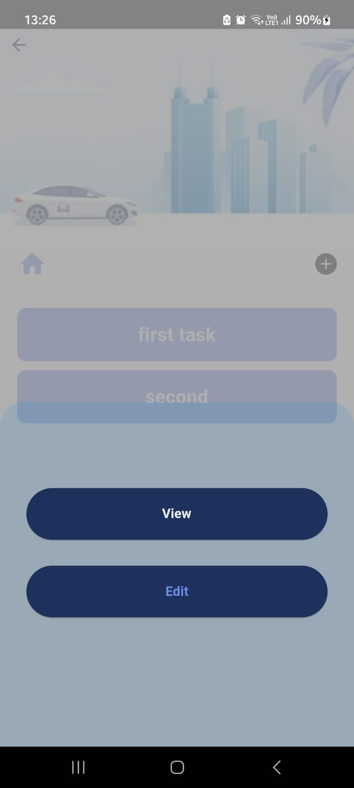

# Task management app

• A full-stack task management application using Flutter for frontend and Golang with the
gin/gonic framework for backend.

• The app allows users to manage their tasks efficiently.

• Integrated MongoDB as the backend database to store and manage expense data on the server side.


## Installation

1. Install Flutter SDK: [Flutter Installation Guide](https://docs.flutter.dev/get-started/install)
2. Install Go: [Go Installation Guide](https://go.dev/doc/install)
3. Install MongoDB: [MongoDB Installation Guide](https://www.mongodb.com/docs/manual/installation/)
4. Clone the repository:
   ```bash
   git clone https://github.com/swag2716/Task-management-app.git
5. Navigate to the project directory:
    ```bash
    cd Task-management-app
6. Install flutter dependencies
    ```bash
    cd frontend
    flutter pub get
7. Install Go dependencies
    ```bash
    cd backend
    go mod download
    ```
    
## Usage

1. Start the backend server
    ```bash
    go run main.go
2. Launch the flutter app:
    ```bash
    flutter run
    ```


## Configuration

1. backend/.env: Set the port no and database connection details.
2. frontend/lib/controllers: Update the backend URL.
## Tech Stack

**Client:** Flutter, Getx

**Server:** Golang, Gin/Gonic, MongoDB


## Screenshots





## Demo

https://drive.google.com/file/d/1BTGIK8yp-vXqYNTyicYK-XU5QJ07Yfs6/view?usp=sharing
